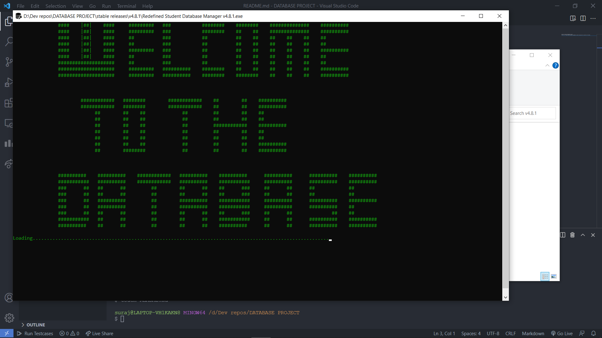
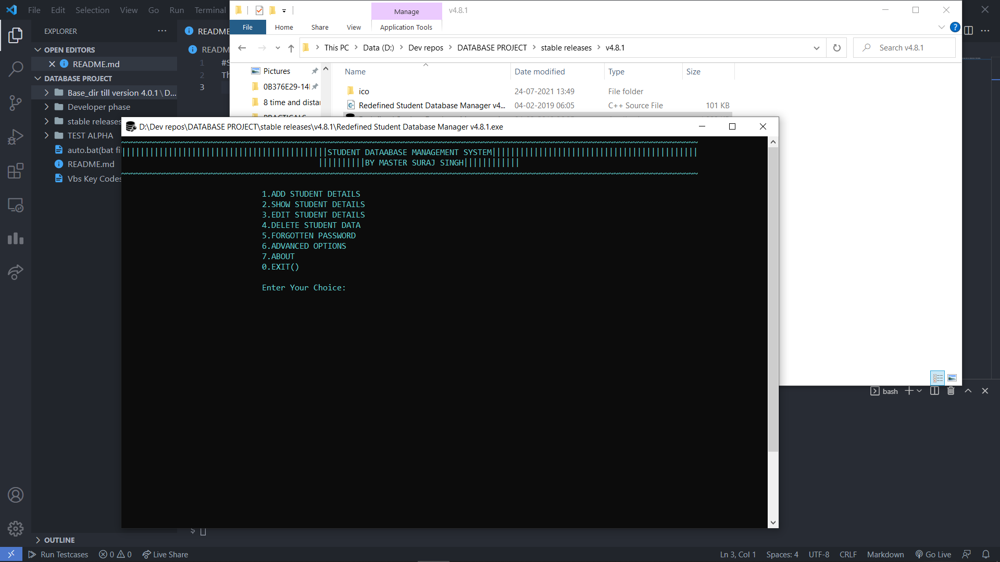
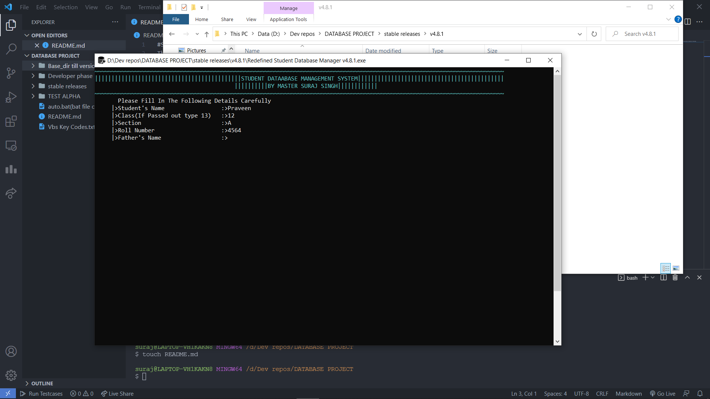
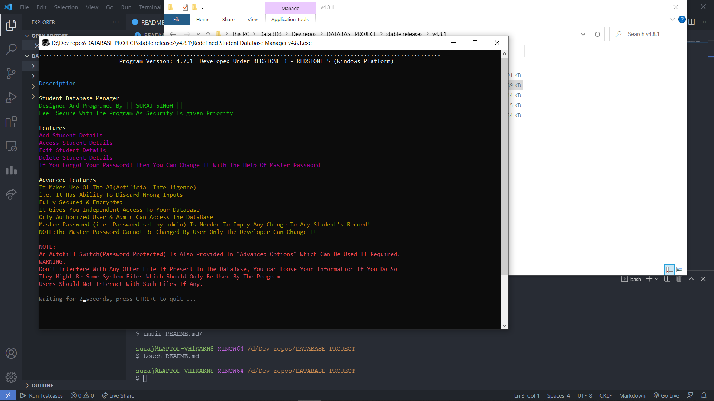
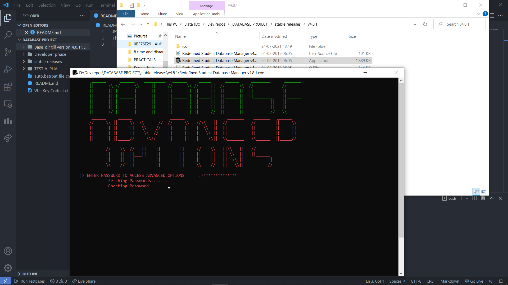

# Student Database Management System

This is a C++ based Database management system,
utilizing the various features of C++ and combining them with system scripts and tools, this program has been designed by keeping security of data as the main priority.

## Run Samples

## Developed in: 2018-2019

## Contributions
Contributions are always welcome !!
